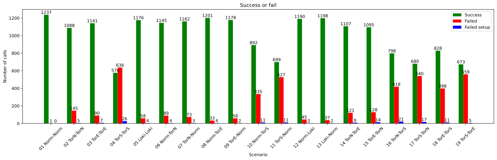
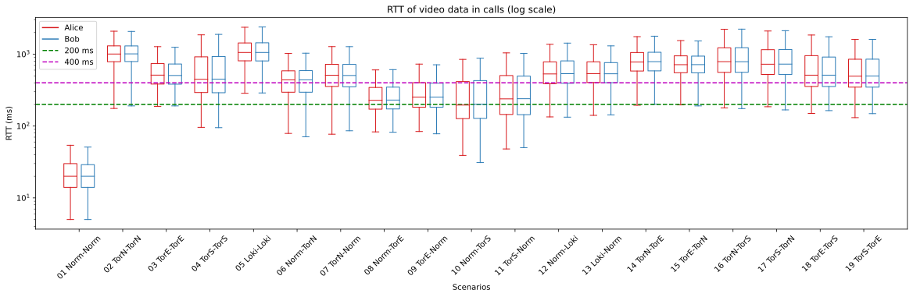

# Data processing

This Readme describes how to get started doing the data processing and shows the results of the experiment.

## Data Access

To get access to the data please read the [DataAccess](./DataAccess.md) document.

## Scenario list

The client will be configured to use one of the following setups:

Networking type   | abbreviation
---               | ---
Normal            | Norm
Tor (Normal)      | TorN
Tor (Europe)      | TorE
Tor (Scandinavia) | TorS
Lokinet           | Loki

One to one.

1.  `Alice` &rarr; `Norm` &rarr; `Turn` &larr; `Norm` &larr; `Bob`
2.  `Alice` &rarr; `TorN` &rarr; `Turn` &larr; `TorN` &larr; `Bob`
3.  `Alice` &rarr; `TorE` &rarr; `Turn` &larr; `TorE` &larr; `Bob`
4.  `Alice` &rarr; `TorS` &rarr; `Turn` &larr; `TorS` &larr; `Bob`
5.  `Alice` &rarr; `Loki` &rarr; `Turn` &larr; `Loki` &larr; `Bob`

Normal to Anonymized in pairs

6.  `Alice` &rarr; `Norm` &rarr; `Turn` &larr; `TorN` &larr; `Bob`
7.  `Alice` &rarr; `TorN` &rarr; `Turn` &rarr; `Norm` &larr; `Bob`
8.  `Alice` &rarr; `Norm` &rarr; `Turn` &larr; `TorE` &larr; `Bob`
9.  `Alice` &rarr; `TorE` &rarr; `Turn` &rarr; `Norm` &larr; `Bob`
10. `Alice` &rarr; `Norm` &rarr; `Turn` &larr; `TorS` &larr; `Bob`
11. `Alice` &rarr; `TorS` &rarr; `Turn` &rarr; `Norm` &larr; `Bob`
12. `Alice` &rarr; `Norm` &rarr; `Turn` &larr; `Loki` &larr; `Bob`
13. `Alice` &rarr; `Loki` &rarr; `Turn` &rarr; `Norm` &larr; `Bob`

Tor to Tor in pairs

14. `Alice` &rarr; `TorN` &rarr; `Turn` &larr; `TorE` &larr; `Bob`
15. `Alice` &rarr; `TorE` &rarr; `Turn` &larr; `TorN` &larr; `Bob`
16. `Alice` &rarr; `TorN` &rarr; `Turn` &larr; `TorS` &larr; `Bob`
17. `Alice` &rarr; `TorS` &rarr; `Turn` &larr; `TorN` &larr; `Bob`
18. `Alice` &rarr; `TorE` &rarr; `Turn` &larr; `TorS` &larr; `Bob`
19. `Alice` &rarr; `TorS` &rarr; `Turn` &larr; `TorE` &larr; `Bob`

For each test call, will there be added logs to Mongo database in the `calls` document which scenario is started and their outcome and when each client detected the session started and ended. In the `reports` document will the ObserveRTC log to, here will the WebRTC specific data be located.

---

## Preprocessing

To get data ready for processing, run the [ExtractRawData](./ExtractRawData.ipynb) notebook. This will connect to the MongoDB and gather the call stats, do som basic data transformation and save it to CSV files which will be overwritten each time the script is called. The outcome will be the following files:

- `output_folder/uniqueCallsAndOutcomes.csv`
- `output_folder/rawReport/c1-Normal.csv`
- `output_folder/rawReport/c2-TorNormal.csv`
- `output_folder/rawReport/c3-TorEurope.csv`
- `output_folder/rawReport/c4-TorScandinavia.csv`
- `output_folder/rawReport/c6-Lokinet.csv`
- `output_folder/rawReport/d1-Normal.csv`
- `output_folder/rawReport/d2-TorNormal.csv`
- `output_folder/rawReport/d3-TorEurope.csv`
- `output_folder/rawReport/d4-TorScandinavia.csv`
- `output_folder/rawReport/d6-Lokinet.csv`

Next run the [SuccessfulCallsStartAndEnd](./SuccessfulCallsStartAndEnd.ipynb) notebook this will for the scenarios `1, 8, 9, 10` and `11` find the start and end times for all the calls in this period. The outcome will be the file:

- `output_folder/SuccessfulCallsStartAndEnd.csv`.

Next to get the bandwidth usage data run the [BandwidthDataExtractionTransmit](./BandwidthDataExtractionTransmit.ipynb) and the [BandwidthDataExtractionReceive](./BandwidthDataExtractionReceive.ipynb) notebooks. the outcome will be the files:

- `output_folder/SuccessfulCallsUsedTransmitBandwidth.csv`
- `output_folder/SuccessfulCallsUsedTransmitBandwidthValues.csv`
- `output_folder/SuccessfulCallsUsedReceiveBandwidth.csv`
- `output_folder/SuccessfulCallsUsedReceiveBandwidthValues.csv`

Now all preprocessing is complete.

---

## Results

This section will show the results of the experiment. Also each sub section will describe which notebooks have been used to generate the specific plots.

### Success or fail overview

The total success and failure rate of the calls can be seen in the [SuccessOrFail](./SuccessOrFail.ipynb) notebook.

And provides the following graph:

### Success rate over time

The success rate over time can be seen in the [SuccessRateOverTime](./SuccessRateOverTime.ipynb) notebook.

And provides the following graph:

Note: Client C4 started to have a technical error from the 2023-01-15. That is the reason for 4 scenarios completely failing from that time and forward.

### RTT in successful calls

Plot for RTT of video and audio on successful calls. Created in the [RoundTripTimeBoxPlot](./RoundTripTimeBoxPlot.ipynb) notebook.

### Jitter in successful calls

Plot for Jitter of video and audio on successful calls. Created in the [JitterBoxPlot](./JitterBoxPlot.ipynb) notebook.

### Average jitter buffer delay

Plot for Average jitter of video and audio on successful calls. Created in the [JitterBufferDelayBoxPlot](./JitterBufferDelayBoxPlot.ipynb) notebook

### Bandwidth used

Plot for the total bandwidth used during successful calls. Created in the [BandwidthUsedPlots](./BandwidthUsedPlots.ipynb) notebook.

