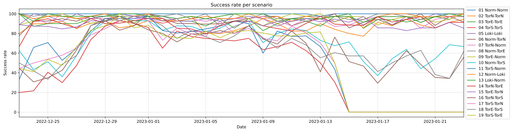
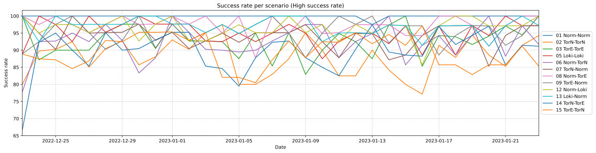
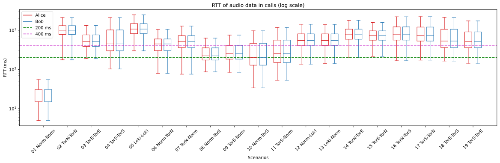
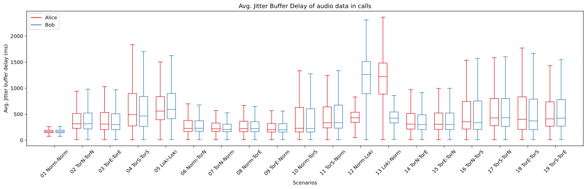
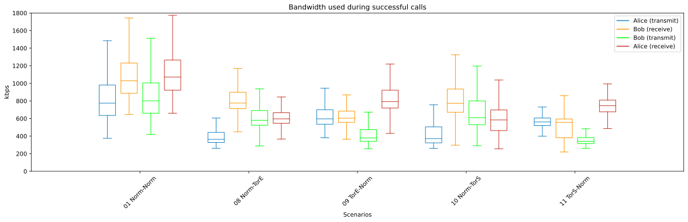

# Data processing

This Readme describes how to get started with the data processing and shows the results of the experiment.

## Data Access

To get access to the data please read the [DataAccess](./DataAccess.md) document.

## Scenario list

To shorten some of the naming, the plots follow the abbreviation scheme the individual clients (c1-c6 and d1-d6) is configured to the specific setup.

Networking type   | abbreviation
---               | ---
Normal            | Norm
Tor (Normal)      | TorN
Tor (Europe)      | TorE
Tor (Scandinavia) | TorS
Lokinet           | Loki

The following tabels are the different scenarios which is being tested. Here c1 referees to the client c1, which can be seen in the [Deployment](../Deployment/Readme.md) documentation.

One to one

Name              |  Setup
---               | ---
01 Norm-Norm      | `Alice, Norm(c1)` &rarr; `Turn` &larr; `Norm(d1), Bob`
02 TorN-TorN      | `Alice, TorN(c2)` &rarr; `Turn` &larr; `TorN(d2), Bob`
03 TorE-TorE      | `Alice, TorE(c3)` &rarr; `Turn` &larr; `TorE(d3), Bob`
04 TorS-TorS      | `Alice, TorS(c4)` &rarr; `Turn` &larr; `TorS(d4), Bob`
05 Loki-Loki      | `Alice, Loki(c6)` &rarr; `Turn` &larr; `Loki(d6), Bob`

Normal to Anonymized in pairs

Name              |  Setup
---               | ---
06 Norm-TorN      | `Alice, Norm(c1)` &rarr; `Turn` &larr; `TorN(d2), Bob`
07 TorN-Norm      | `Alice, TorN(c2)` &rarr; `Turn` &larr; `Norm(d1), Bob`
08 Norm-TorE      | `Alice, Norm(c1)` &rarr; `Turn` &larr; `TorE(d3), Bob`
09 TorE-Norm      | `Alice, TorE(c3)` &rarr; `Turn` &larr; `Norm(d1), Bob`
10 Norm-TorS      | `Alice, Norm(c1)` &rarr; `Turn` &larr; `TorS(d4), Bob`
11 TorS-Norm      | `Alice, TorS(c4)` &rarr; `Turn` &larr; `Norm(d1), Bob`
12 Norm-Loki      | `Alice, Norm(c1)` &rarr; `Turn` &larr; `Loki(d6), Bob`
13 Loki-Norm      | `Alice, Loki(c6)` &rarr; `Turn` &larr; `Norm(d1), Bob`

Tor to Tor in pairs

Name              |  Setup
---               | ---
14 TorN-TorE      | `Alice, TorN(c2)` &rarr; `Turn` &larr; `TorE(d3), Bob`
15 TorE-TorN      | `Alice, TorE(c3)` &rarr; `Turn` &larr; `TorN(d2), Bob`
16 TorN-TorS      | `Alice, TorN(c2)` &rarr; `Turn` &larr; `TorS(d4), Bob`
17 TorS-TorN      | `Alice, TorS(c4)` &rarr; `Turn` &larr; `TorN(d2), Bob`
18 TorE-TorS      | `Alice, TorE(c3)` &rarr; `Turn` &larr; `TorS(d4), Bob`
19 TorS-TorE      | `Alice, TorS(c4)` &rarr; `Turn` &larr; `TorE(d3), Bob`

For each test call, there will be created logs that goes to the Mongo database. In the `calls` table the following will be present: which scenario is started, the outcome of the call and when each client detected the session started and ended. The ObserveRTC logs will go to the `reports` table, where the WebRTC specific data is located.

---

## Preprocessing

To get data ready for processing, run the [ExtractRawData](./ExtractRawData.ipynb) notebook. This will connect to the MongoDB and gather the call stats, do som basic data transformation and save it to CSV files, which will be overwritten each time the script is called. The outcome will be the following files:

- `output_folder/uniqueCallsAndOutcomes.csv`
- `output_folder/rawReport/c1-Normal.csv`
- `output_folder/rawReport/c2-TorNormal.csv`
- `output_folder/rawReport/c3-TorEurope.csv`
- `output_folder/rawReport/c4-TorScandinavia.csv`
- `output_folder/rawReport/c6-Lokinet.csv`
- `output_folder/rawReport/d1-Normal.csv`
- `output_folder/rawReport/d2-TorNormal.csv`
- `output_folder/rawReport/d3-TorEurope.csv`
- `output_folder/rawReport/d4-TorScandinavia.csv`
- `output_folder/rawReport/d6-Lokinet.csv`

Next, run the [SuccessfulCallsStartAndEnd](./SuccessfulCallsStartAndEnd.ipynb) notebook, this will for the scenarios `1, 8, 9, 10` and `11` find the start and end timestaps of all the successful calls. The outcome will be the file:

- `output_folder/SuccessfulCallsStartAndEnd.csv`.

Next, to get the bandwidth usage data, run the [BandwidthDataExtractionTransmit](./BandwidthDataExtractionTransmit.ipynb) and the [BandwidthDataExtractionReceive](./BandwidthDataExtractionReceive.ipynb) notebooks. The outcome will be the files:

- `output_folder/SuccessfulCallsUsedTransmitBandwidth.csv`
- `output_folder/SuccessfulCallsUsedTransmitBandwidthValues.csv`
- `output_folder/SuccessfulCallsUsedReceiveBandwidth.csv`
- `output_folder/SuccessfulCallsUsedReceiveBandwidthValues.csv`

Now all preprocessing is complete.

---

## Results

This section will show the results of the experiment that was gathered during the project. Also each sub section will describe which notebooks have been used to generate the specific plots.

### Success or fail overview

The total success and failure rate of the calls can be seen in the [SuccessOrFail](./SuccessOrFail.ipynb) notebook.

And provides the following graph:

### Success rate over time

The success rate over time can be seen in the [SuccessRateOverTime](./SuccessRateOverTime.ipynb) notebook.

And provides the following graph:

Note: Client C4 started to have a technical error from the 2023-01-15. That is the reason for 4 scenarios completely failing from that time and forward.

### RTT in successful calls

Plot for RTT of video and audio on successful calls. Created in the [RoundTripTimeBoxPlot](./RoundTripTimeBoxPlot.ipynb) notebook.

### Jitter in successful calls

Plot for Jitter of video and audio on successful calls. Created in the [JitterBoxPlot](./JitterBoxPlot.ipynb) notebook.

### Average jitter buffer delay

Plot for Average jitter of video and audio on successful calls. Created in the [JitterBufferDelayBoxPlot](./JitterBufferDelayBoxPlot.ipynb) notebook

### Bandwidth used

Plot for the total bandwidth used during successful calls. Created in the [BandwidthUsedPlots](./BandwidthUsedPlots.ipynb) notebook.

