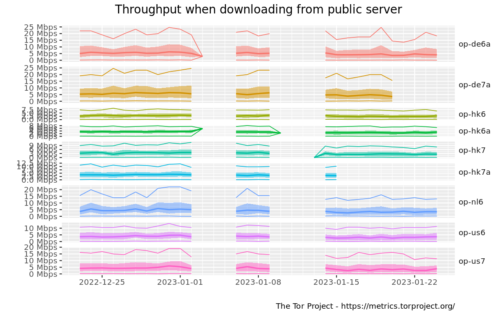

# External material

To supplement the results gathered in the experiment this material will be used to validate the results.

The following list of images and files comes from the sites [https://metrics.torproject.org/onionperf-throughput](https://metrics.torproject.org/onionperf-throughput.html?start=2022-12-23&end=2023-01-24&server=public) and [https://metrics.torproject.org/onionperf-latencies](https://metrics.torproject.org/onionperf-latencies.html?start=2022-12-23&end=2023-01-24&server=public)

The file [onionperf-throughput-2022-12-23-public-2023-01-24.csv](./onionperf-throughput-2022-12-23-public-2023-01-24.csv) can produce the graph below

The file [onionperf-latencies-2022-12-23-public-2023-01-24.csv](./onionperf-latencies-2022-12-23-public-2023-01-24.csv) can produce the graph below

