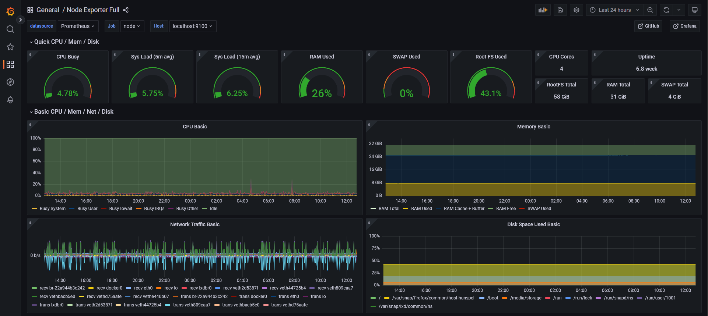

# Host A - Application server

The purpose of the server is to coordinate the tests which will be executed, Store the logs and statuses of the tests and do data processing of the results.

## Setup

To control the services are there in each of the sub folder an example `.env` file which contains the environment variables which is needed for the respective services to run.

When the `.env` files have been configured, the service can be controlled with the makefile.

```shell
$ make

Options include:
  upload  - Uploads the local configuration files
  start   - Starts the services from docker-compose
  stop    - Stops the services from docker-compose
  restart - Stops and starts the services.
  status  - Get the status of the services
  pull    - Pulls the latest images of the services
  logs    - Get the latest 20 logs and follows the next logs
  ssh     - Gets an ssh shell on the server
```

### Caddy

[Caddy](https://caddyserver.com/) is a reverse proxy that can handle TLS certificates and pass the raw TCP socket data to the respective applications.

### WebRTC

The [React application](https://github.com/Master2022E/simple-webrtc) which the clients will use to facilitate a call.

### Signal

The [signaling server](https://github.com/Master2022E/SignalServer) that coordinates the clients when they join specific rooms.

### ObserveRTC

[ObserveRTC](https://observertc.org/) is a backend for receiving statistics of WebRTC streams.

### MongoDB

The [MonogDB](https://www.mongodb.com/) database will stores the records saved by ObserveRTC and where we can query data for our notebook scripts.

To access the database from a developer machine one needs to make a local ssh port forward to the server.

```shell
ssh -TNL 27017:127.0.0.1:27017 agpbruger@db.thomsen-it.dk -p 22022
```

### Grafana

[Grafana](https://grafana.com/) in combination with [Prometheus](https://prometheus.io/) and [Node Exporter](https://github.com/prometheus/node_exporter) could give some easy insights to the load of the server.



To access Grafana run a shell with the command below and then access it on [localhost:4000](http://localhost:4000)
```shell
ssh -TNL 4000:127.0.0.1:4000 agpbruger@a.thomsen-it.dk -p 22022
```


## Initial setup

To run the applications on the server are the applications [docker](https://www.docker.com/) and [docker-compose](https://docs.docker.com/compose/gettingstarted/) needed.

### Firewall

Some applications are not meant to be exposed to the internet. Therefor is the the application ufw used to manage iptables on the server. The following ufw rules is used

```shell
sudo ufw allow 22022 comment 'Allow SSH connections'
sudo ufw allow 443 comment 'HTTPS connections'
sudo ufw allow 80 comment 'HTTP redirected to HTTPS'
sudo ufw allow 3000 comment 'Signaling websocket server'

```

This gives the configuration like shown below.

```shell
sudo ufw status
Status: active

To                         Action      From
--                         ------      ----
22022                      ALLOW       Anywhere                   # Allow SSH connections
80                         ALLOW       Anywhere                   # HTTP redirected to HTTPS
443                        ALLOW       Anywhere                   # HTTPS connections
3000                       ALLOW       Anywhere                   # Signaling websocket server
22022 (v6)                 ALLOW       Anywhere (v6)              # Allow SSH connections
80 (v6)                    ALLOW       Anywhere (v6)              # HTTP redirected to HTTPS
443 (v6)                   ALLOW       Anywhere (v6)              # HTTPS connections
3000 (v6)                  ALLOW       Anywhere (v6)              # Signaling websocket server
```

> FIXME: Add a option to allow machines from Host C and Host D to access the mongodb server. [link](https://www.digitalocean.com/community/tutorials/ufw-essentials-common-firewall-rules-and-commands) with example of how to allow specific ips and ports access.