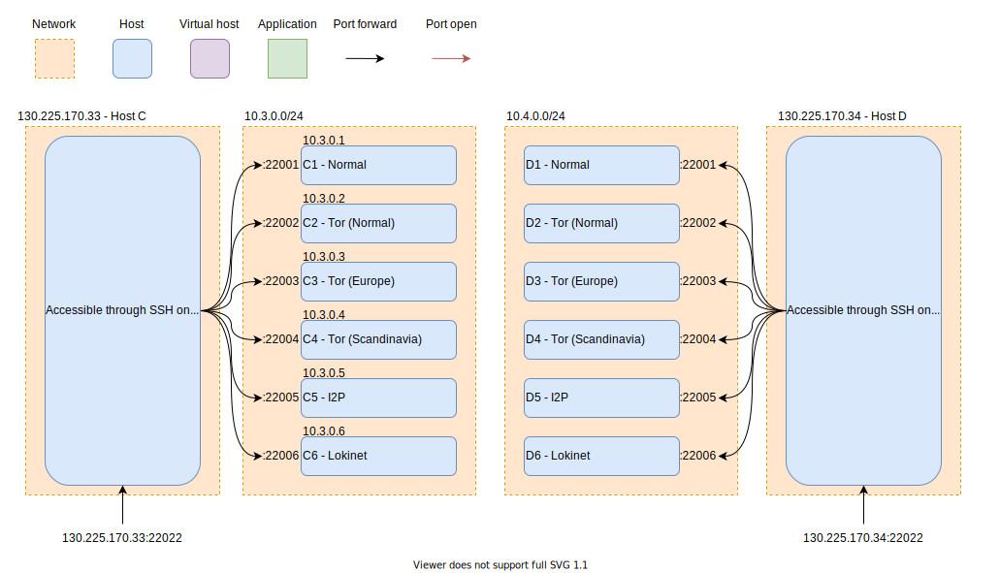

# Host C and D - Router

The purpose of the two routers is to act as a gateway for their respective clients C1-6 and D1-6, so they can access the internet. Furthermore, the routers are responsible for port forwarding SSH connection to the clients so we can communicate and control the clients.




## Firewall Setup
For setting up the router, the following steps are needed:
1. Change forwarding policy of packets on the host:
```shell
sudo vim /etc/default/ufw
# Change the line `DEFAULT_FORWARD_POLICY="DROP"` to `DEFAULT_FORWARD_POLICY="ACCEPT"`
```

2. Allow Ipv4 forwarding of packets on the host:
```shell
sudo nano  /etc/ufw/sysctl.conf 
# Uncomment this `net/ipv4/ip_forward=1` line
```

3. Change UFW rules to do ssh port forwarding to each host:
```shell
sudo nano  /etc/ufw/before.rules 

# nat Table rules
*nat
:POSTROUTING ACCEPT [0:0]

# Forward traffic from eth1 through eth0.
-A POSTROUTING -s 10.x.0.0/24 -o eth0 -j MASQUERADE
-A PREROUTING -i eth0 -d $WAN_SIDE_IP -p tcp --dport 22001 -j  DNAT --to-destination 10.x.0.1:22022
-A PREROUTING -i eth0 -d $WAN_SIDE_IP -p tcp --dport 22002 -j  DNAT --to-destination 10.x.0.2:22022
-A PREROUTING -i eth0 -d $WAN_SIDE_IP -p tcp --dport 22003 -j  DNAT --to-destination 10.x.0.3:22022
-A PREROUTING -i eth0 -d $WAN_SIDE_IP -p tcp --dport 22004 -j  DNAT --to-destination 10.x.0.4:22022
-A PREROUTING -i eth0 -d $WAN_SIDE_IP -p tcp --dport 22005 -j  DNAT --to-destination 10.x.0.5:22022
-A PREROUTING -i eth0 -d $WAN_SIDE_IP -p tcp --dport 22006 -j  DNAT --to-destination 10.x.0.6:22022
# don't delete the 'COMMIT' line or these nat table rules won't be processed
COMMIT
```

4. Restart UFW
```shell
sudo ufw disable && sudo ufw enable
```

5. Verify by sshing into the client using the port forwarded port specificed in the before.rules file.
```shell
ssh user@ip -p 22001
```

6. The forwarding and port forwarding rules should now be setup. Now we just need to add an extra ufw rule to allow the ssh connection to the router.

```shell
sudo ufw allow 22022 comment 'Allow SSH connections'
```
This gives the configuration like shown below.

```shell
sudo ufw status
Status: active

To                         Action      From
--                         ------      ----            
22022                      ALLOW IN    Anywhere                       
22022 (v6)                 ALLOW IN    Anywhere (v6) 
```
