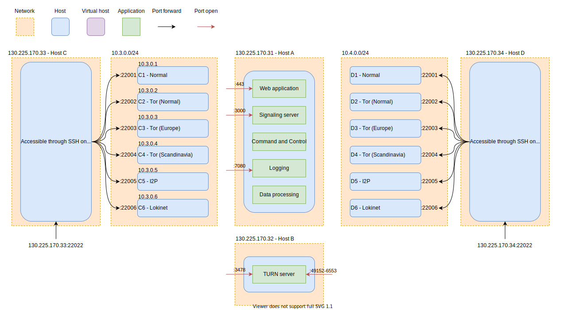

# Deployment details

Here is the information for deploying the entire application stack

In the figure below are there an overview of the four servers, and what applications runs where. The "backend" infrastructure runs on host A and B.

The deployment of host A, B, C and D can be seen in the sub folders:

- [HostA-Application](./HostA-Application/Readme.md)
- [HostB-Turn](./HostB-Turn/Readme.md)
- [HostCD-Router](./HostCD-Router/Readme.md)

The [Deployment](./Deployment.drawio.svg) diagram describes the server deployment structure that we expect to deploy and run the tests with.

