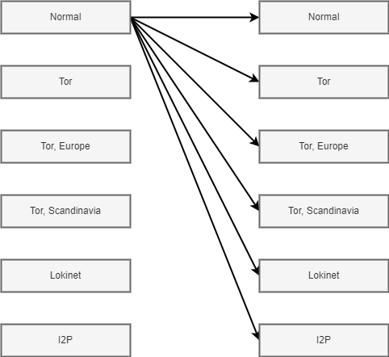
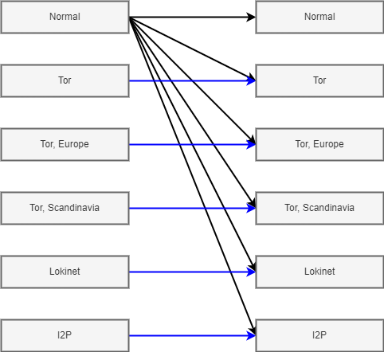
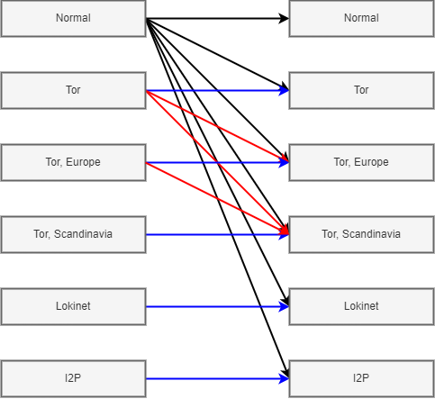
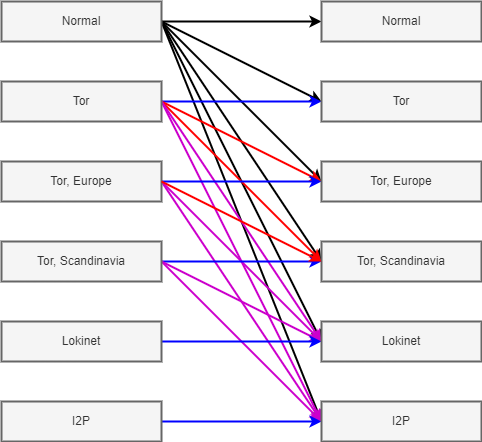
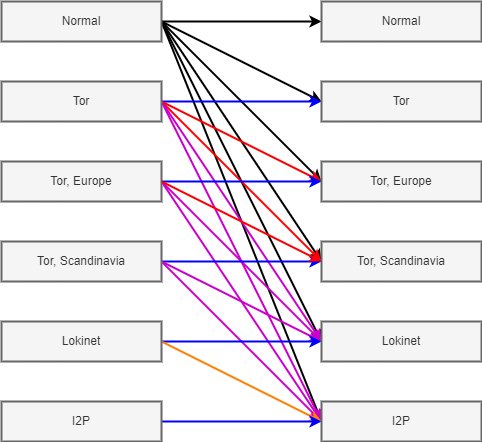

# Test configurations

Here is all the combinations which we could run the tests in described.

## Configuration 1

## Configuration 2

## Configuration 3

## Configuration 4

## Configuration 5

