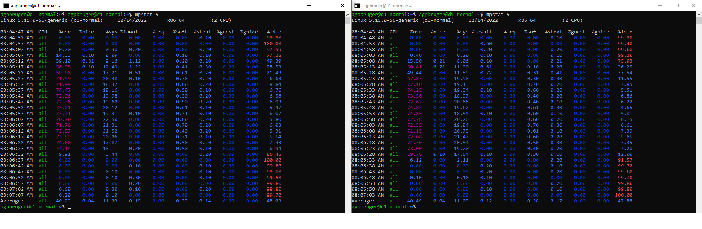
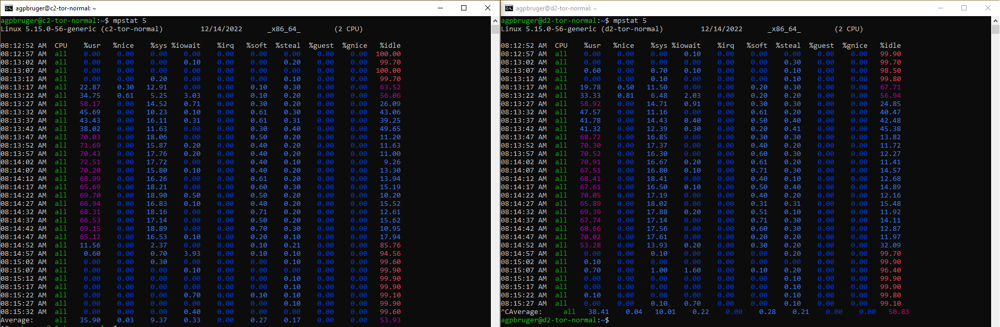
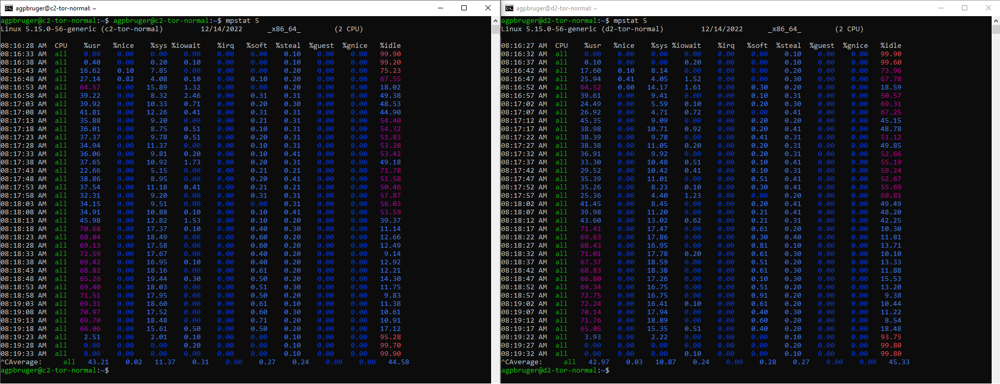

# CPU Verification

TODO: Add a run for each of the clients.

Quick fix is to add the images we currently have:

## Normal Clients [C1 and D1]

## Tor Normal Clients [C2 and D2]

Run 1

Run 2

## Conclusion

The clients is just on the limit, but they can handle the calls.