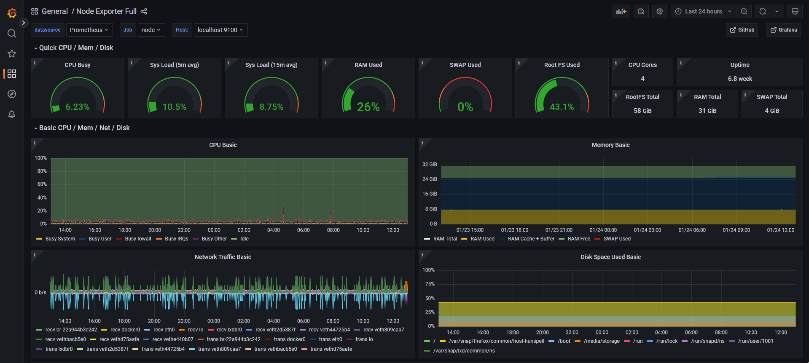
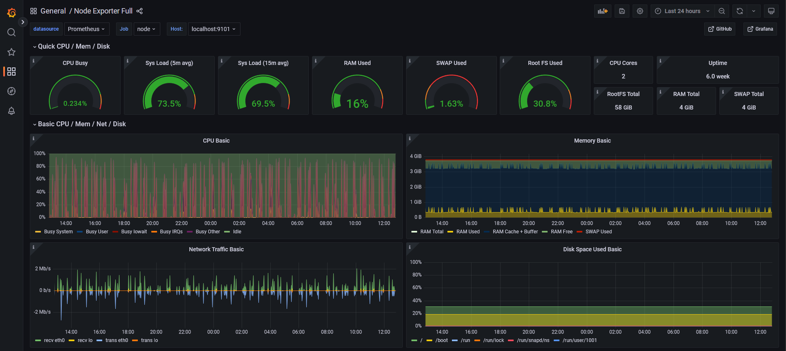
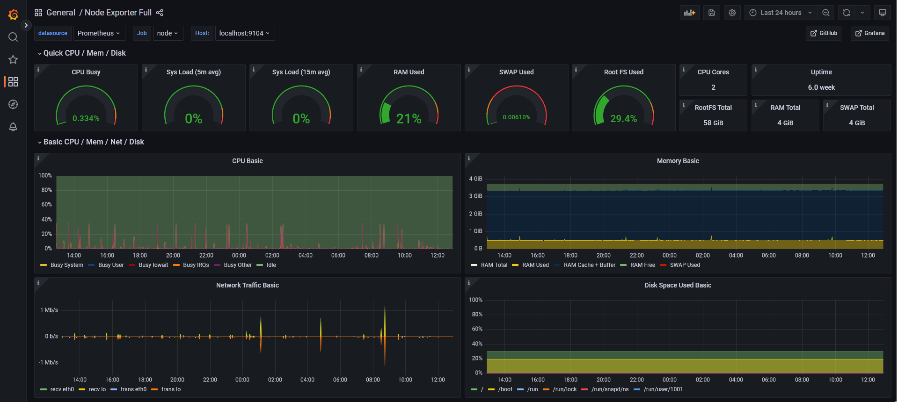
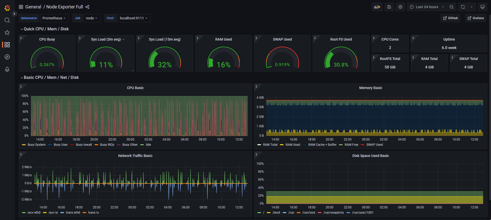
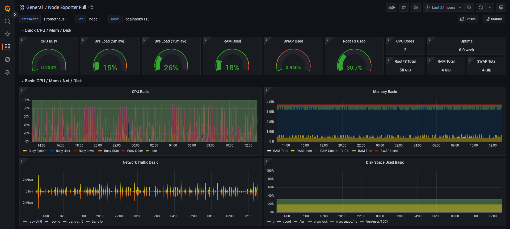
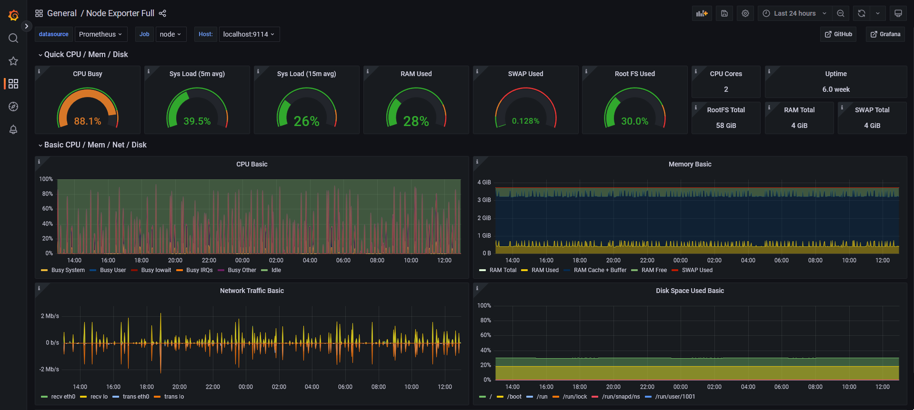
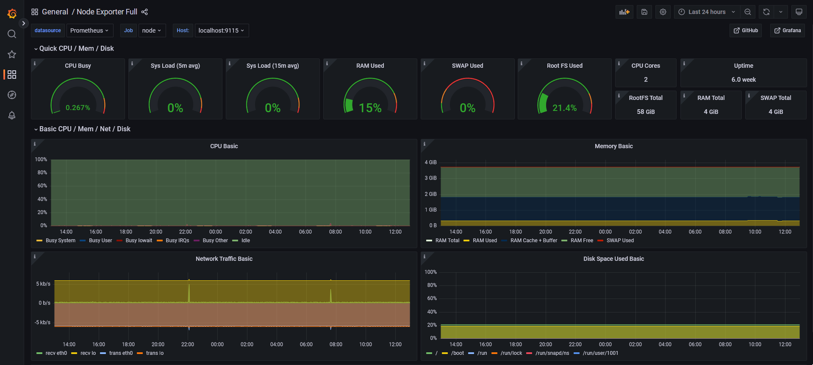
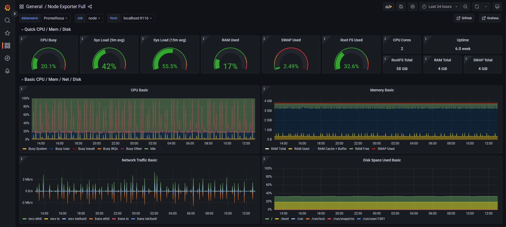

# Node exporter views of experiment

The following screenshots shows the node exporter data for the clients in the experiment.

## Host A

## Client C1

## Client C2

## Client C3

## Client C4

## Client C5

## Client C6

## Client D1

## Client D2

## Client D3

## Client D4

## Client D5

## Client D6
