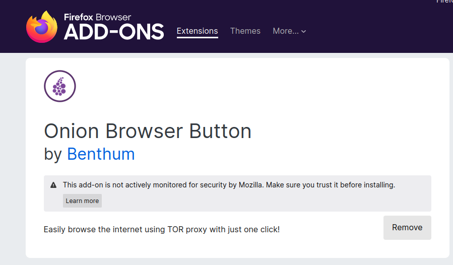
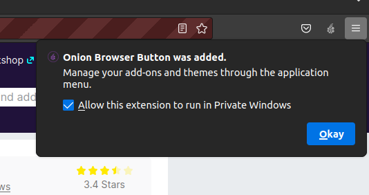
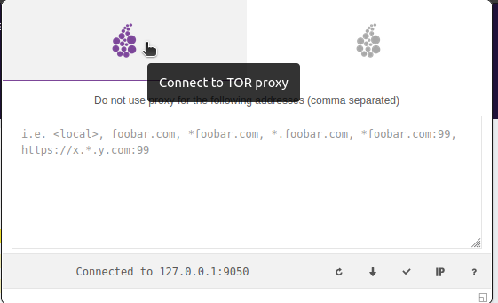

## Fake video and audio stream

To simulate a Video and audio call, we create a fake webcame and microphone, which the browser can get as a input stream and use for the WebRTC stream/application. See the script [**setup_fake_webcam.sh**](../client_scripts/setup_fake_webcam.sh) for setting it up in ubuntu.

The script requires an input video which can be fetched from the script [**get_bigbunny_video.sh**](../client_scripts/get_bigbunny_video.sh).

## Development

When developing in a VM with ssh in vs code, you can enable x11 Forwarding, by running an ssh session in another terminal window by running the command:

```shell
ssh -X user@VM
```

## Tor setup

The client should have installed and setup a running instance of tor.
See the script [**setup_tor.sh**](../client_scripts/setup_tor.sh) for ubuntu instructions

Because of the possible privacy leaks in using STUN and WebRTC, WebRTC has been disabled from the Tor Browser. So the project uses the firefox Browser, and sets the proxy settings to point at the local Tor proxy. A ff addon is needed for quick access to setting the Tor proxy. The [addon](https://addons.mozilla.org/en-US/firefox/addon/tortm-browser-button/) simply adds a button for toggling the tor proxy on and off.


When setting up the addon, it will ask for permisson to also run in "Private Window", press Allow and press Okay.



When the addon has been added, you simply need to press start and wait for the "Connected to 127.0.0.1:9050" message. Now you are connected to the Tor network.

