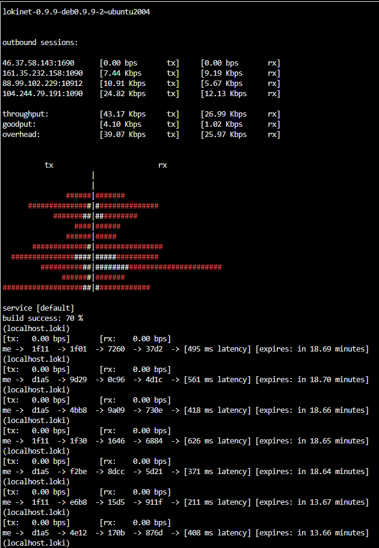

# Lokinet

This folder contains tools and scripts to get infromation from Lokinet

## Monitor

The script comes from [the loki project](https://github.com/oxen-io/lokinet/blob/dev/contrib/py/admin/lokinetmon) and is located in [Monitor](./Monitor/)

To run the monitor

```shell
python -m pip install -r requirements.txt
python lokimonitor.py
```

Then something like this should show.

